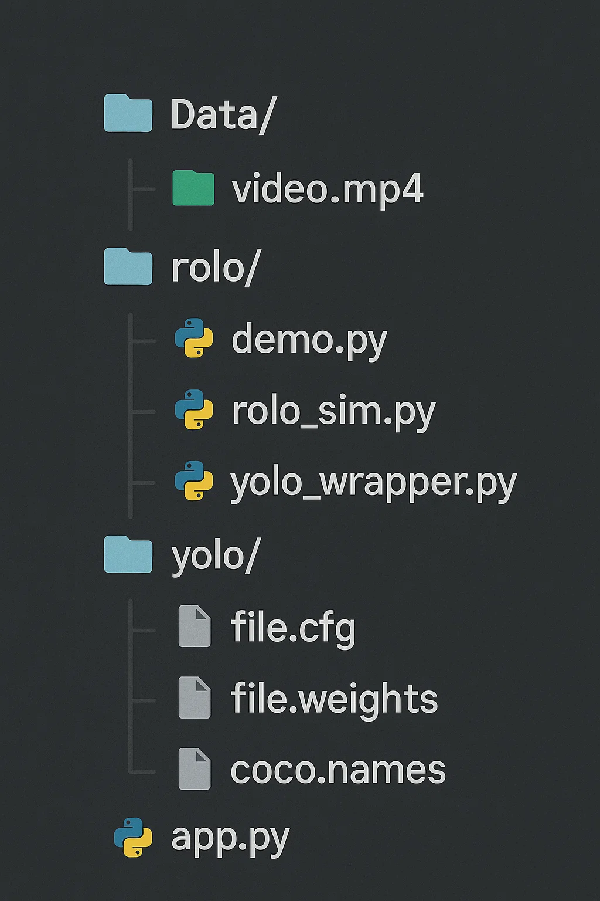

## Run the Demo

To run the ROLO demo, use the following command:

```bash
python -m rolo.demo
```

## Model Files
You can download the model files from [Google Drive](https://drive.google.com/drive/folders/1iwfb6mcimNVMdBjLduMPnS4NfrB-tU6O?usp=drive_link).

Note: After download the models file from yolo, put them in yolo folder

## 📁 Project Structure



´´´bash
.
├── Data/
│   └── video.mp4              # Input video file
├── rolo/
│   ├── demo.py                # Main ROLO demo runner
│   ├── rolo_sim.py            # ROLO simulation or test logic
│   └── yolo_wrapper.py        # YOLO interface for ROLO
├── yolo/
│   ├── file.cfg               # YOLO configuration file
│   ├── file.weights           # Pre-trained YOLO weights
│   └── coco.names             # Class label names
├── app.py                     # Streamlit web interface
├── requirements.txt           # Python dependencies
└── README.md                  # You’re here!
´´´
